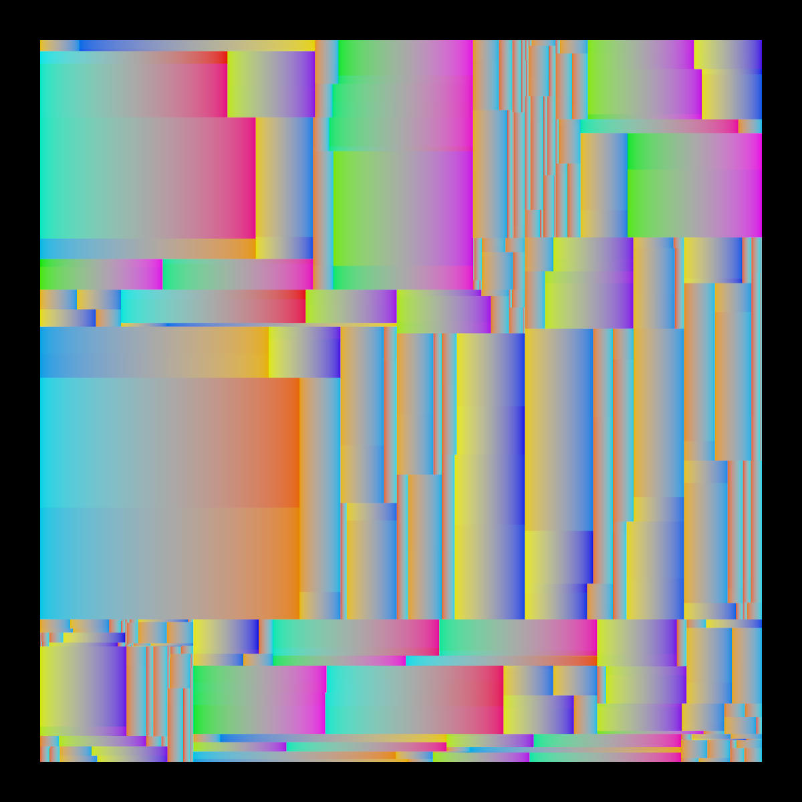
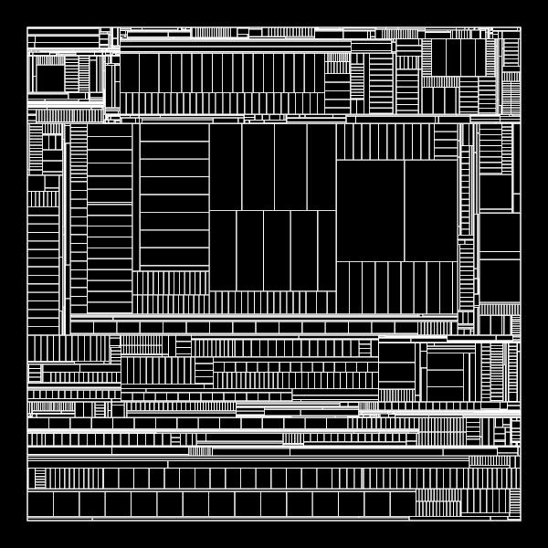

 

# Split Tree Artwork
A generative artwork created by splitting rectangles according to a random binary tree and animating the split ratio. 
Originally created for *Streifen*, an open air cinema event series at *objekt klein a*.

## Run
```cargo run --release```